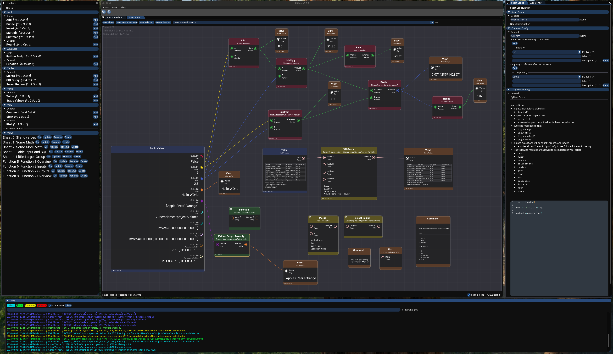

# Althea

Althea is a node-based editor that serves as an example of using `imgui_node_editor` from `imgui_bundle` in python.

* Created 2022-2024 by James Bishop (`james@bishopdynamics.com`)
* License: GPLv3, see [License.txt](License.txt)

## What is this?

This is not the greatest app in the world, this is just a demo/example/tribute. As-is, this app does not "do" much at all, it is just a bunch of GUI. The purpose is to provide an example of how to use `imgui_node_editor` in a python application.

I wanted to build some kind of node-based thing, and I found that [`imgui_bundle`](https://github.com/pthom/imgui_bundle) includes [`imgui_node_editor`](https://github.com/thedmd/imgui-node-editor) but only has a very minimal example of how to use it.
So I started out by trying to adapt the [`blueprint.cpp`](https://github.com/thedmd/imgui-node-editor/tree/master/examples/blueprints-example) example into python.

Once I had the basics working, I started adding more interesting things like type checking, tabular data, etc. I have used [RestrictedPython](https://github.com/zopefoundation/RestrictedPython) in previous projects, so it seemed logical to create a node that executed an snippet of python, and I'm pretty happy with how that implementation turned out, complete with a decent editor!

After that, I had some pretty large example files going, and I realized that I needed a way to have a single node stand in place for a whole sheet of nodes, exposing only inputs and outputs. This kicked off a huge refactoring that touched just about everything, in order to enable a node to define the number and types of inputs and outputs at runtime. There are definitely some quirks that I still have not resolved, that are side-effects of this refactor, but the result works quite well!

## What we have so far

What we have right now is a pretty minimal implementation that, I believe, shows off enough of `imgui_node_editor`'s features to provide a great starting point for future development.

- a set of nodes which demonstrate some basic functionality, as well as extensibility
- create/save/load a workspace, containing multiple independent sheets of nodes
- create special "function" sheets, which can be referenced as a single node in other sheets (including other function sheets)
- import tabular data from most common formats
- define static values
- view common value types
- view tabular data as table, or configurable plot
- all nodes are configurable, using an app-wide common configuration format
- app, workspace, sheet, and node-level configuration (again all common format)
- common editor UI for configuration
- logging system (including from python snippets) with filtering, search, levels
- create "view" bookmarks, to show off a specific set of nodes
- the whole UI is composed of dockable,resizable windows and a menubar

## Room for Improvement

There are some things I would improve, or do differently next time:

- Many, many more nodes
  - a plugin system for collections of nodes?
- Type system: just use python's type system, creating the whole VarTypes system was not necessary
- DPI scaling: imgui has issues with rendering consistently at different resolutions and DPI settings
  - there are documented ways to address this
- Backend: the whole multithreaded/multiprocess job processing system is probably overkill for most use cases
  - when using workers as processes, sometimes fails to cleanly kill off child processes when app exits
- State: first time tracking app state like this, I do not like it
- theme / colors: theming was largely ignored. Some of the built-in theming works
- data flow and time:
  - right now, this system is not capable of efficiently working with continuously changing data streams
  - this means we cannot do time-based logic like: do X, wait 4 seconds, then do Y
  - cannot handle "live" data, such as video frames from a webcam
  - as-is these things are not impossible nor prevented, but cpu usage will be awful
- imgui_bundle version: right now I am stuck at `v1.3.0` due to an issue with `v1.5.2` that I have not figured out

## What should I do with this?

- use it as an example to learn how to use `imgui_bundle` and `imgui_node_editor`
- expand upon it by creating a bunch of specialized nodes to serve your use-case
- fix something (see Room for Improvement, above) and submit a PR
- find a big mistake I made, or simply "the wrong way to do that", and report an issue (or ideally fix it and submit a PR!)

## What should I NOT do with this?

- request new features
- report tiny, nitpick issues that do not really matter
- submodule or directly depend upon this project in any way (just make a copy!)
- integrate this as part of some mission-critical business workflow

## Dependencies

- macOS, Linux, or Windows
- python 3.11 or newer, with `pip` and `virtualenv`
- see [requirements.txt](requirements.txt)

## Usage

You can run this project as a normal python script by running `test.sh`; this is meant for development.

You can "compile" this project into a standalone executable or app using `build-app.sh`, and then you can find the resulting executable/app inside `./dist/`; this is meant for distribution.

Development was done on macOS 14/15, using python 3.12, however it has been successfully tested on Windows and Linux without issue.
All scripts are `bash` scripts; on Windows suggest Git for Windows and then used Git Bash.
